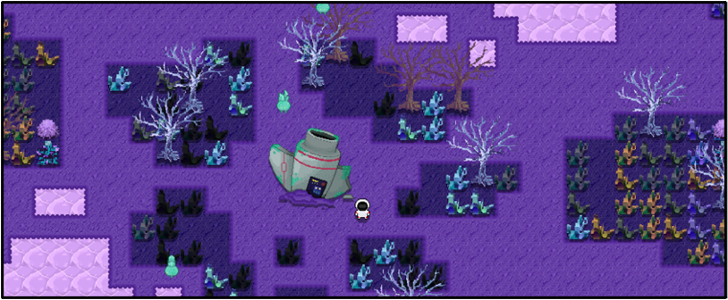

# Star Farm

### Presented by UBC Game Dev Team 6

**Programming:** Clarence Chiu, Kyle van Winkoop, Randy Russell, Santiago Sira, Brian Chau\
**Artwork:** Anna Yun, Michelle Kim\
**Writing:** Connor Zhou\
**Music:** Shaoxin Deng

### About the Game

A pixel art, resource management adventure taking inspiration from games like Minecraft, Stardew Valley, Factorio and Starbound! Take on the role of a daring astronaut stranded on an unfamiliar inhospitable planet.

### Gameplay 

Dive into a dangerous adventure! Collect and farm the 15 different metals found on the planet so that you can repair your ship and escape this planet. 

  
  
  
  

But be careful! As you start to expand your farm around the planet, new monsters will start attacking your farm to steal your metals. Keep upgrading your weapon and build walls and turrets to fight against the waves of monsters.

The player’s multitool provides them with the means to alter the world around them. By breaking obstacles, building defences, and growing plants, the player has the means to make the world their own. 	

|   |   |
| ------------- | ------------- |
| Farm minerals  | Build walls & turrets to defend your ship |
|   |   |
| Engage in battles with enemies and bosses  | Use the forge to craft new items |

### Play

Download `Star-Farm.exe` from the Github repo and try out the game!\

Requires Windows OS

### Game Guide

#### Controls

[WASD] to move\
[Tab] for mode selection\
[Space] for cycling through modes\
[Left shift] for cycling through modes backwards

#### Building mode

[Left click] to place down structures (Structure needs to be selected in general inventory)\
[Right click] to damage structures

#### Farming mode

[Left click] to till ground
[Left click] on tilled ground to place seeds (Seed needs to be selected in seed inventory)
[Right click] to harvest grown plants

#### Combat mode

[Left click] to melee attack nearby enemies
[Right click] to shoot enemies from range

#### Watering mode

[Left click] on tilled ground to water plants and make them grow faster

