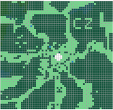

# Star Farm

### Presented by UBC Game Dev Team 6

**Development:** Clarence Chiu, Kyle van Winkoop, Randy Russell, Santiago Sira, Brian Chau\
**Artwork:** Anna Yun, Michelle Kim\
**Writing:** Connor Zhou\
**Music:** Shaoxin Deng

## About the Game

A pixel art, resource management adventure taking inspiration from games like Minecraft, Stardew Valley, Factorio and Starbound! Take on the role of a daring astronaut stranded on an unfamiliar inhospitable planet.

## Gameplay 

Dive into a dangerous adventure! Collect and farm the 15 different metals found on the planet so that you can repair your ship and escape this planet. 

  
  
  
  

But be careful! As you start to expand your farm around the planet, new monsters will start attacking your farm to steal your metals. Keep upgrading your weapon and build walls and turrets to fight against the waves of monsters.

The player’s multitool provides them with the means to alter the world around them. By breaking obstacles, building defences, and growing plants, the player has the means to make the world their own. 	

|   |   |
| ------------- | ------------- |
| Farm minerals  | Build walls & turrets to defend your ship |
|   |   |
| Engage in battles with enemies and bosses  | Use the forge to craft new items |

## Play

Download `Star-Farm.exe` from the Github repo and try out the game!

Requires Windows OS

### Game Guide

#### Controls

[WASD] to move\
[Tab] for mode selection\
[Space] for cycling through modes\
[Left shift] for cycling through modes backwards

#### Building mode

[Left click] to place down structures (Structure needs to be selected in general inventory)\
[Right click] to damage structures

#### Farming mode

[Left click] to till ground\
[Left click] on tilled ground to place seeds (Seed needs to be selected in seed inventory)\
[Right click] to harvest grown plants

#### Combat mode

[Left click] to melee attack nearby enemies\
[Right click] to shoot enemies from range\

#### Watering mode

[Left click] on tilled ground to water plants and make them grow faster

## Development of the Game

#### Brainstorming

The first few weeks were spent brainstorming and generating ideas. Our list of potential games had over twenty different ideas for us to choose from! Star farm seemed to be the most promising at the time. The idea came with loads of flexibility and potential that we felt we could easily build on. 

#### Map and Environment

One of the first things we started working on was the game map. The general layout of the map changed plenty of times throughout development as we added new features to the game. Our initial concept for our map was very vague: alien planet. We built on that concept throughout development, our concept evolving a wild, untamed and dangerous alien environment.

|   |   |  |
| ------------- | ------------- | ------------- |
| Early concept  | Beta map | Final map |

#### The Ship

We needed an interface to allow the player to allow the player to use everything they got from the world. We decided to use the players' crashed ship to allow them to upgrade their tools, fix the ship, and forge new metals and items. This provided the player with an incentive to keep farming and expanding.

## Plans for the future

We plan to build on what we currently have, adding more metals, items and metals. Our concept has monumental room to expand, providing the opportunity to add in things like  healing potions made from zinc, electronic components made from electrum and possibly even using gemstones as a high-end material. With so much room for expansion, we are excited to see where future development will take us!

Eventually, once we feel that we have exhausted the potential of the concept, we hope to release the game on Steam. Once we are finished with Star Farm, we will go back to the drawing board, and take on one of the other ideas we came up with during brainstorming, or maybe a whole new concept all together.

## Key Learnings

Having started this project in October 2019, the team has certainly learned and grown a lot. Working on the game for six months have not only helped us develop technical and artistic skills, but also taught us a lot about the process of game development as a whole. Many members of our team were new to game development, and developing a game from start to finish in only six months taught us to quickly learn new skills and adapt new and unfamiliar changes.

Throughout the process, there were many times when we had to change and reconsider different aspects of the game. With such little time to complete the game, we had to be able to quickly adapt to new changes and made adjustments to the content to allow everything to move smoothly.  Learning to adapt to changes was one of the main ways we grew during this project.

